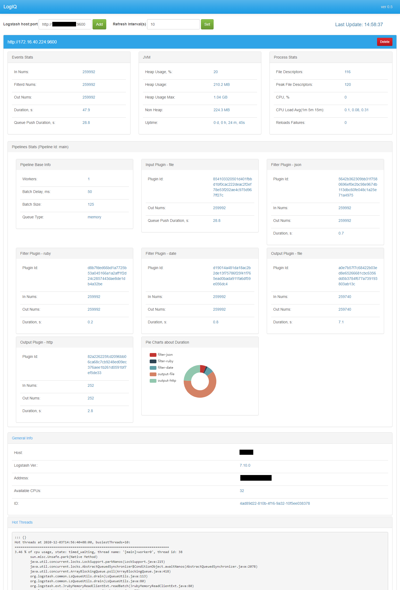

# LogIQ

LogIQ is a simple monitoring front end for Elastic Logstash. It uses Monitoring [API](https://www.elastic.co/guide/en/logstash/current/monitoring.html).

Works for Logstash version > **6.0** (**7.0** has also been tested).



# Usage
Just open the html page and add your Logstash hosts with port number. You need internet connection as the page uses external libraries like bootstrap and jquery.

# Logstash Configuration
You need to enable remote connections on Logstash, just add the line in Logstash config file (default /path/to/logstash/config/logstash.yml):

```http.host: "0.0.0.0"```

Logstash may not allow CORS calls, you can use proxy to [fix](https://enable-cors.org/server_nginx.html) this.
Install Nginx and add this section in /etc/nginx/nginx.conf:

```
server {
        listen       9601;
        location / {
          if ($request_method = 'GET') {
          add_header 'Access-Control-Allow-Origin' '*';
          add_header 'Access-Control-Allow-Methods' 'GET';
          add_header 'Access-Control-Allow-Headers' 'DNT,X-CustomHeader,Keep-Alive,User-Agent,X-Requested-With,If-Modified-Since,Cache-Control,Content-Type,Content-Range,Range';
          add_header 'Access-Control-Expose-Headers' 'DNT,X-CustomHeader,Keep-Alive,User-Agent,X-Requested-With,If-Modified-Since,Cache-Control,Content-Type,Content-Range,Range';
          }
          proxy_pass http://logstash:9600;
        }
    }
```

Don't forget to set your logstash hostname and exposed port.
After Nginx restart it will proxy requests from port 9601 to 9600 with right headeres.


# TO-DO
- Add Logstash disconnections handling
- Add charts
- Make as a browser plugin

# Feedback
[sadovenko@gmail.com]()
